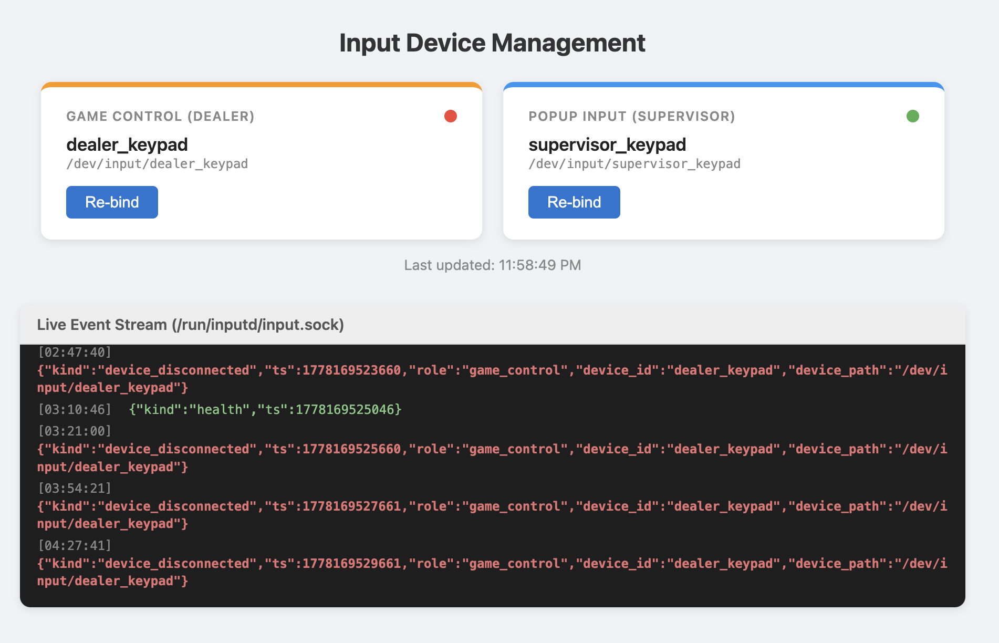

# inputd

Ubuntu 24.04 Desktop NUC 上的鍵盤角色映射 daemon。識別實體鍵盤，分別對應 `primary_input`（主要操作員）與 `secondary_input`（次要操作員）兩個角色，將按鍵事件透過 Unix socket 推送給 APP。支援 udev 熱插拔自動發現，遠端操作工具（RustDesk）建立的虛擬鍵盤會自動加入 `secondary_input`，無需額外設定。



## 需求

- Ubuntu 24.04 Desktop (amd64)
- Go 1.22+
- root 執行權限（讀取 `/dev/input`）

## 建置

```bash
cd $GITHUB_WORKSPACE
go build -o /usr/local/bin/inputd ./cmd/inputd
```

## 安裝

### 1. 設定 udev 規則（穩定裝置路徑）

**XFFP XFKEY 主要操作員鍵盤**（以名稱模糊匹配，換 USB port 不受影響）：

> 注意：檔名必須大於 `60`（例如 `99-`），以確保系統內建的 `input_id` 工具已先行標記 `ID_INPUT_KEYBOARD` 變數。

```
# /etc/udev/rules.d/99-primary_keypad.rules
SUBSYSTEM=="input", KERNEL=="event*", ENV{ID_INPUT_KEYBOARD}=="1", ATTRS{name}=="*XFFP*", \
  SYMLINK+="input/primary_keypad", GROUP="ops", MODE="0660"
SUBSYSTEM=="input", KERNEL=="event*", ENV{ID_INPUT_KEYBOARD}=="1", ATTRS{name}=="*XFKEY*", \
  SYMLINK+="input/primary_keypad", GROUP="ops", MODE="0660"
```

**次要操作員鍵盤（Fallback 綁定）**（排除主要操作員鍵盤後，只要有鍵盤功能即自動綁定）：

> `ENV{ID_INPUT_KEYBOARD}=="1"` 對應於 `Handlers=kbd`，可確保不會綁定到純滑鼠裝置。

```
# /etc/udev/rules.d/99-secondary_keypad.rules
SUBSYSTEM=="input", KERNEL=="event*", ENV{ID_INPUT_KEYBOARD}=="1", ATTRS{name}!="*XFFP*", ATTRS{name}!="*XFKEY*", \
  SYMLINK+="input/secondary_keypad", GROUP="ops", MODE="0660"
```

套用規則：

```bash
udevadm control --reload-rules && udevadm trigger --subsystem-match=input
# 確認 symlink 已建立
ls -la /dev/input/primary_keypad /dev/input/secondary_keypad
```

### 2. 建立 systemd service

```ini
# /etc/systemd/system/inputd.service
[Unit]
Description=Input role mapping daemon
After=local-fs.target

[Service]
Type=notify
ExecStart=/usr/local/bin/inputd --config /etc/inputd/config.yaml --web-addr 127.0.0.1:17888
WatchdogSec=90s
Restart=always
RestartSec=2
RuntimeDirectory=inputd
RuntimeDirectoryMode=0755
SupplementaryGroups=ops
NoNewPrivileges=true

[Install]
WantedBy=multi-user.target
```

啟動：

```bash
systemctl daemon-reload
systemctl enable --now inputd
systemctl status inputd
```

### 3. 初次綁定鍵盤

如果是全新安裝，設定檔會自動建立預設值（`/etc/inputd/config.yaml`）。

若兩把鍵盤接在標準 USB port，預設設定應可直接使用。若需重新綁定，使用管理介面（見下方）。

## 使用

### 管理介面（Web UI）

在 NUC 本機瀏覽器開啟：

```
http://127.0.0.1:17888
```

畫面顯示兩個角色卡片與連線狀態。

**重新綁定鍵盤（Learn Mode）**：

1. 點擊角色卡片上的「**重新綁定**」
2. 看到 15 秒倒數後，在目標鍵盤上按任意鍵
3. 顯示「✓ 綁定成功」，設定自動存檔

| 狀態指示 | 意義 |
|---|---|
| 綠點 | 裝置連線中 |
| 紅點 | 裝置離線（已綁定但拔除） |
| 灰點 | 未綁定 |
| 藍點閃爍 | Learn mode 進行中 |

### 即時事件監聽（測試用）

```bash
nc -U /run/inputd/input.sock
```

按鍵後會看到 JSON 輸出，例如：

```json
{"kind":"key","ts":1715040000123,"role":"primary_input","device_id":"primary_keypad","code":96,"code_name":"KEY_KPENTER","value":1}
```

### 查詢角色狀態

```bash
curl -s http://127.0.0.1:17888/v1/roles | python3 -m json.tool
```

### 重載設定

```bash
curl -s -X POST http://127.0.0.1:17888/v1/config/reload
# 或
kill -HUP $(systemctl show -p MainPID inputd | cut -d= -f2)
```

## 啟動參數

```
inputd [--config PATH] [--web-addr ADDR] [--log-level LEVEL]
```

| 參數 | 預設值 | 說明 |
|---|---|---|
| `--config` | `/etc/inputd/config.yaml` | 設定檔路徑 |
| `--web-addr` | `127.0.0.1:17888` | Web UI 監聽位址，空字串停用 |
| `--log-level` | `info` | 日誌層級：`debug`、`info`、`warn`、`error` |

## APP 整合

APP / 後端服務應連接 `/run/inputd/input.sock`，讀取 JSON Lines 事件流。若後端跑在 Docker，建議只掛載 `/run/inputd`：

```yaml
services:
  backend:
    volumes:
      - /run/inputd:/run/inputd
    environment:
      INPUTD_SOCKET: /run/inputd/input.sock
```

不建議 Docker 後端直接掛載並讀取 `/dev/input`。那會讓後端承擔 raw evdev、device cgroup、udev symlink、熱插拔、鍵盤角色辨識與權限管理；container 也可能需要 `privileged: true` 或較大的 device 權限。`inputd` 在 host 上處理硬體層，Docker 後端只讀角色化後的 JSON 事件，穩定性與維運邊界都比較清楚。

### Node.js 範例

APP 連接 `/run/inputd/input.sock`：

```js
const net = require('net')
const readline = require('readline')

const PRIMARY_KEYS = new Set([50, 96, 55, 98])  // primary_input 的 4 個按鍵

function connect() {
  const sock = net.createConnection('/run/inputd/input.sock')
  const rl = readline.createInterface({ input: sock })

  rl.on('line', line => {
    const ev = JSON.parse(line)
    if (ev.kind !== 'key' || ev.value !== 1) return  // 只處理 key down

    if (ev.role === 'primary_input' && PRIMARY_KEYS.has(ev.code)) {
      // code 50=DEAL, 96=CONFIRM, 55=CANCEL, 98=NEXT
    } else if (ev.role === 'secondary_input') {
      // 次要操作員鍵盤，標準 keycode
    }
  })

  sock.on('close', () => setTimeout(connect, 3000))
}

connect()
```

> `code 28`（KEY_ENTER）會隨 `code 96` 同時出現，屬韌體行為，`PRIMARY_KEYS` 白名單可自然過濾。

### Go 後端範例

```go
package main

import (
	"bufio"
	"encoding/json"
	"log"
	"net"
	"os"
	"time"
)

type InputEvent struct {
	Kind     string `json:"kind"`
	TS       int64  `json:"ts"`
	Role     string `json:"role"`
	Code     uint16 `json:"code"`
	CodeName string `json:"code_name"`
	Value    int32  `json:"value"`
}

var gameKeys = map[uint16]string{
	50: "DEAL",
	96: "CONFIRM",
	55: "CANCEL",
	98: "NEXT",
}

func main() {
	socketPath := os.Getenv("INPUTD_SOCKET")
	if socketPath == "" {
		socketPath = "/run/inputd/input.sock"
	}

	for {
		if err := consume(socketPath); err != nil {
			log.Printf("inputd disconnected: %v; reconnecting in 3s", err)
			time.Sleep(3 * time.Second)
		}
	}
}

func consume(socketPath string) error {
	conn, err := net.Dial("unix", socketPath)
	if err != nil {
		return err
	}
	defer conn.Close()

	log.Printf("inputd connected: %s", socketPath)
	scanner := bufio.NewScanner(conn)
	for scanner.Scan() {
		var ev InputEvent
		if err := json.Unmarshal(scanner.Bytes(), &ev); err != nil {
			continue
		}
		handleEvent(ev)
	}
	return scanner.Err()
}

func handleEvent(ev InputEvent) {
	switch ev.Kind {
	case "key":
		if ev.Value != 1 { // 只處理 key down，忽略 repeat / key up
			return
		}
		if ev.Role == "primary_input" {
			if action, ok := gameKeys[ev.Code]; ok {
				log.Printf("primary action=%s code=%d", action, ev.Code)
			}
			return
		}
		if ev.Role == "secondary_input" {
			log.Printf("secondary key code=%d name=%s", ev.Code, ev.CodeName)
		}
	case "device_connected", "device_disconnected", "health":
		log.Printf("inputd status kind=%s role=%s", ev.Kind, ev.Role)
	}
}
```

## 故障排除

**daemon 未啟動**：
```bash
journalctl -u inputd -n 30
```

**symlink 消失**（換接 USB port 後）：
```bash
udevadm trigger --subsystem-match=input
```

**事件沒有輸出**：
```bash
curl -s http://127.0.0.1:17888/v1/roles  # 確認 online: true
```

**遠端鍵盤（RustDesk）未自動加入**：確認 `secondary_input` 設定了 `auto_discover: true`，並查看 log 確認自動發現是否觸發：
```bash
journalctl -u inputd -f | grep auto-discovered
```

詳細故障排除、完整 API 參考與部署說明見 [DEPLOYMENT.md](DEPLOYMENT.md)。

## 專案結構

```
inputd/
├── cmd/inputd/main.go          # 程式入口
├── internal/
│   ├── config/config.go        # YAML 設定
│   ├── evdev/
│   │   ├── evdev.go            # Linux evdev 原始讀取（無 CGo）
│   │   └── keycodes.go         # keycode 名稱對照表
│   └── daemon/
│       ├── daemon.go           # 核心編排
│       ├── reader.go           # 每個 role 的 evdev 讀取 goroutine
│       ├── udev.go             # NETLINK_KOBJECT_UEVENT 監聽與熱插拔自動發現
│       ├── broadcast.go        # event socket 與事件廣播
│       ├── learn.go            # learn mode
│       ├── api.go              # HTTP control API
│       ├── webui.go            # Web UI
│       └── ui.html             # 管理介面（embed 進 binary）
└── go.mod
```
